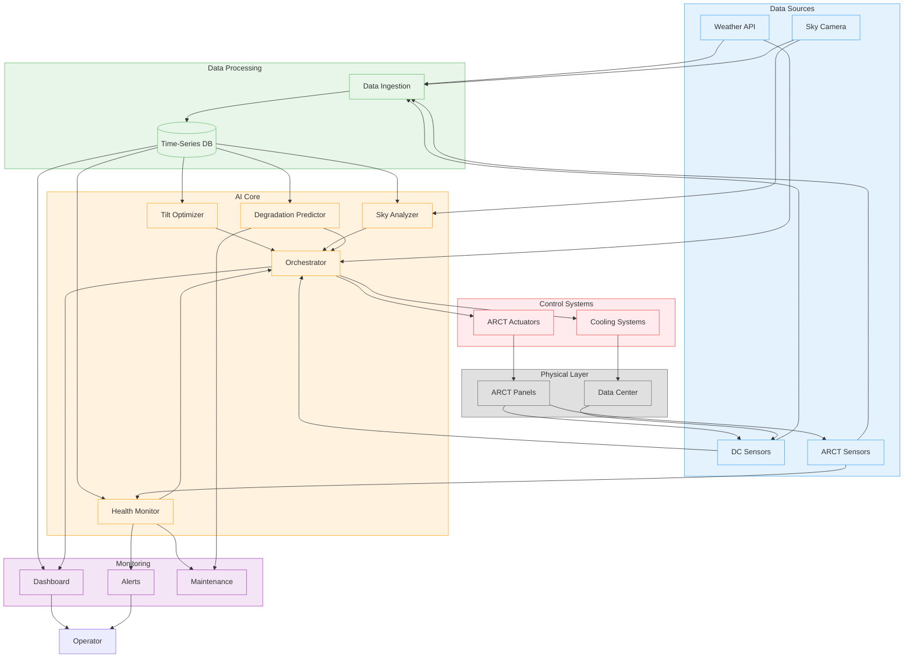

```mermaid

graph TD
    %% ==== Simplified Architecture ====
    
    %% --- Data Sources ---
    subgraph DataSources["Data Sources"]
        DS1[Weather API]
        DS2[Sky Camera]
        DS3[DC Sensors]
        DS4[ARCT Sensors]
    end

    %% --- Processing ---
    subgraph Processing["Data Processing"]
        DI[Data Ingestion]
        DB[(Time-Series DB)]
    end

    %% --- AI Core ---
    subgraph AI["AI Core"]
        M1[Tilt Optimizer]
        M2[Sky Analyzer]
        M3[Health Monitor]
        M4[Degradation Predictor]
        CTRL[Orchestrator]
    end

    %% --- Control ---
    subgraph Control["Control Systems"]
        AA[ARCT Actuators]
        CS[Cooling Systems]
    end

    %% --- Physical ---
    subgraph Physical["Physical Layer"]
        ARCT[ARCT Panels]
        DC[Data Center]
    end

    %% --- UI ---
    subgraph UI["Monitoring"]
        DASH[Dashboard]
        ALERT[Alerts]
        MT[Maintenance]
    end

    %% ==== Connections ====
    DS1 --> DI
    DS2 --> DI
    DS3 --> DI
    DS4 --> DI
    DI --> DB

    DB --> M1
    DB --> M2
    DB --> M3
    DB --> M4
    DS2 --> M2
    DS4 --> M3

    M1 --> CTRL
    M2 --> CTRL
    M3 --> CTRL
    M4 --> CTRL
    DS3 --> CTRL
    DS1 --> CTRL

    CTRL --> AA
    CTRL --> CS
    AA --> ARCT
    CS --> DC
    ARCT --> DS3
    ARCT --> DS4
    DC --> DS3

    DB --> DASH
    CTRL --> DASH
    M3 --> ALERT
    M3 --> MT
    M4 --> MT
    DASH --> Operator
    ALERT --> Operator

    %% ==== Styling ====
    classDef data fill:#E3F2FD,stroke:#42A5F5
    classDef process fill:#E8F5E9,stroke:#66BB6A
    classDef ai fill:#FFF3E0,stroke:#FFA726
    classDef control fill:#FFEBEE,stroke:#EF5350
    classDef physical fill:#E0E0E0,stroke:#757575
    classDef ui fill:#F3E5F5,stroke:#AB47BC

    class DataSources,DS1,DS2,DS3,DS4 data
    class Processing,DI,DB process
    class AI,M1,M2,M3,M4,CTRL ai
    class Control,AA,CS control
    class Physical,ARCT,DC physical
    class UI,DASH,ALERT,MT ui
```
