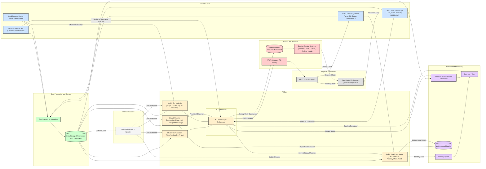

```mermaid

graph LR
    %% --- Data Sources ---
    subgraph "Data Sources"
        WS["Weather Services API (Forecast and Historical)"]
        LS["Local Sensors (Meteo Station, Sky Camera)"]
        DCS["Data Center Sensors (IT Load, Temp, Humidity, BMS/DCIM)"]
        AS["ARCT Sensors (Surface Temp, Tilt, Status, Degradation?)"]
    end

    %% --- Data Processing & Storage ---
    subgraph "Data Processing and Storage"
        DI["Data Ingestion & Validation"]
        DB[("Data Storage (Time-Series DB / Data Lake)")]
    end

    %% --- AI Core ---
    subgraph "AI Core"
        TP["Model: Tilt Prediction (Weather, Load → Angle)"]
        SA["Model: Sky Analysis (Image → Clear Sky % / Direction)"]
        HM["Model: Health Monitoring (ARCT Sensors → Anomaly/Maint. Need)"]
        MD["Model: Material Degradation (History, UV → Lifespan/Efficiency)"]
        
        subgraph "AI Orchestrator"
            CTRL["AI Control Logic / Orchestrator"]
        end
    end

    %% --- Control & Actuation ---
    subgraph "Control and Actuation"
        AA["ARCT Actuators (Tilt Motors)"]
        ECS["Existing Cooling Systems (via BMS/DCIM: CRACs, Chillers, Liquid)"]
        BMS[("BMS / DCIM Interface")]
    end

    %% --- Physical Environment ---
    subgraph "Physical Environment"
        ARCT["ARCT Units (Physical)"]
        DC["Data Center Environment (Internal Temperature)"]
    end

    %% --- Outputs & Monitoring ---
    subgraph "Outputs and Monitoring"
        DASH["Reporting & Visualization Dashboard"]
        USER["Operator / User"]
        ALERT["Alerting System"]
        MT[("Maintenance Planning")]
    end

    %% --- Offline Processes ---
    subgraph "Offline Processes"
        TRAIN["Model Retraining & Updates"]
    end

    %% --- Connections ---
    WS --> DI
    LS --> DI
    DCS --> DI
    AS --> DI
    DI --> DB
    
    DB --> TP
    DB --> SA
    LS -- "Sky Camera Image" --> SA
    DB --> HM
    AS --> HM
    DB --> MD
    
    TP --> CTRL
    SA --> CTRL
    HM -- "Current Status/Efficiency" --> CTRL
    MD -- "Predicted Efficiency" --> CTRL
    DCS -- "Real-time Load/Temp" --> CTRL
    WS -- "Real-time/Short-term Forecast" --> CTRL
    
    CTRL -- "Tilt Commands" --> AA
    CTRL -- "Cooling Mode Commands" --> BMS
    
    AA --> ARCT
    BMS --> ECS
    
    ARCT -- "Cooling Effect" --> DC
    ECS -- "Cooling Effect" --> DC
    DC -- "Measured Temp" --> DCS
    ARCT -- "Measured State" --> AS
    
    DB --> DASH
    CTRL -- "System Status" --> DASH
    HM -- "Anomaly Alerts" --> ALERT
    MD -- "Degradation Forecast" --> MT
    HM -- "Maintenance Needs" --> MT
    ALERT --> USER
    DASH --> USER
    USER -- "Queries/Overrides?" --> CTRL
    
    DB -- "Historical Data" --> TRAIN
    TRAIN -- "Updated Models" --> TP
    TRAIN -- "Updated Models" --> SA
    TRAIN -- "Updated Models" --> HM
    TRAIN -- "Updated Models" --> MD

    %% Style definitions
    classDef datasrc fill:#cde4ff,stroke:#333,stroke-width:2px;
    classDef dataproc fill:#ccffcc,stroke:#333,stroke-width:2px;
    classDef aicore fill:#fff0cc,stroke:#333,stroke-width:2px;
    classDef control fill:#ffcccc,stroke:#333,stroke-width:2px;
    classDef physical fill:#e0e0e0,stroke:#333,stroke-width:2px;
    classDef output fill:#e6ccff,stroke:#333,stroke-width:2px;
    classDef offline fill:#f5f5f5,stroke:#666,stroke-width:1px,stroke-dasharray:5 5;

    class WS,LS,DCS,AS datasrc;
    class DI,DB dataproc;
    class TP,SA,HM,MD,CTRL aicore;
    class AA,ECS,BMS control;
    class ARCT,DC physical;
    class DASH,USER,ALERT,MT output;
    class TRAIN offline;
```
